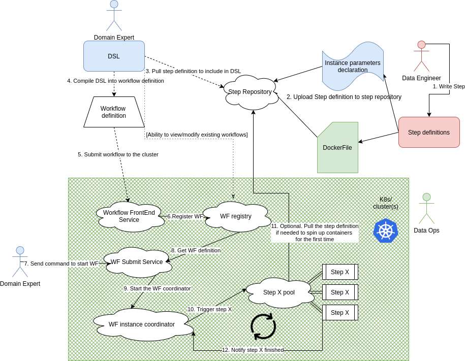

# Big data workflows as a service on running in software containers

## Targets:
1. Build a minimal working solution, leveraging the implementation Yared created.
2. Capturing Edge/ Cloud topologies at design time and leveraging that information at runtime.
3. Study the implications of using containers in the Big Data world. Consider both opportunities and challenges.

## Implementation ideas:
1. Leverage as many functionalities offered by the container orchestration ecosystem such as [dapr](https://github.com/dapr/dapr) and other projects.
2. Build Big Data Workflows as a service (from the perspective of the Domain expert)
3. Allow for introspection into the excecution of workflows to better understand the implications of running containerized steps and the challenges of the underlying hardware topology (cloud/ edge). 

## Small scope solution architecture

A few points in the diagram do not need to be implemented from the start (for example the step repository interaction with the DSL).

After the minimal solution, various components of the architecture will be added / modified to better address the targeted challenges.

## Ideas for the future (no well-defined order):
These are ideas that could be worth exploring. Most of them will likely have design-time implications (how do you surface certain aspects through the DSL); others will have run-time implication only, but how do you surface the necessary interfaces in the step templates to allow the data engineers to make use of the functionalities provided by the proposed framework?

* Micoservices to expose the state the the steps/ workflows/ clusters. Definetly useful for debugging/ development but also to gain insights and evaluate the solution at later stages of the project.

* The logic handling where steps are executed / provisioned need to take into account parameters, available resources and data locality.

* Elasticity: inject logic into the step pool to automatically scale up when the queue of tasks to be processed gets too large. Also entails the existence of a "garbage collector" to free up unused containers.
  
* Data splitting. How is it possible to automatically split data (not need special steps) - to better parallelize the workflow without intervention. Probably something in the step template. 
  
* Redis cache to serve as the intermediary between steps to avoid disk I/O. Tapping into the best practices of microservices. We are in the big data world, disk I/O is an important factor for throughput/ latencies. Or in-memory file system implementation on Kubernetes? That'd be awesome.

* Edge and cloud not being in the same Kubernetes cluster. Cross-cluster orchestration. Might require pulling up some of the serives.
    
* For step 10-11-12: We can go for a pre-allocation approach where each workflow instance reserves cluster resources at the start. This might be wasteful though, as we block resources which are not actively used.
    
* The master node (or smaller versions of coordinators) should also live in close proximity (or in the same boundary (edge/cloud)) as the workers

* The step container notify the master of events (e.g. WorkFinished) through a PubSub system (or a system where events can be broadcasted to multiple interested parties)

